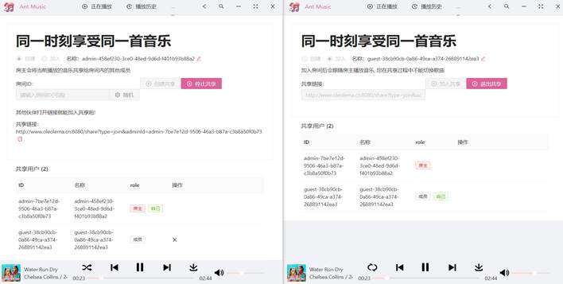
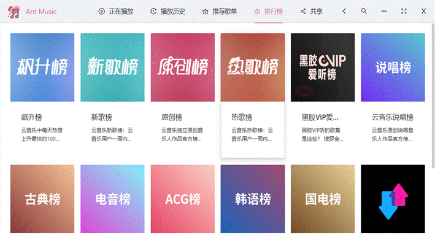
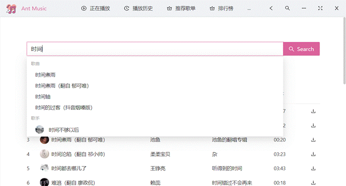
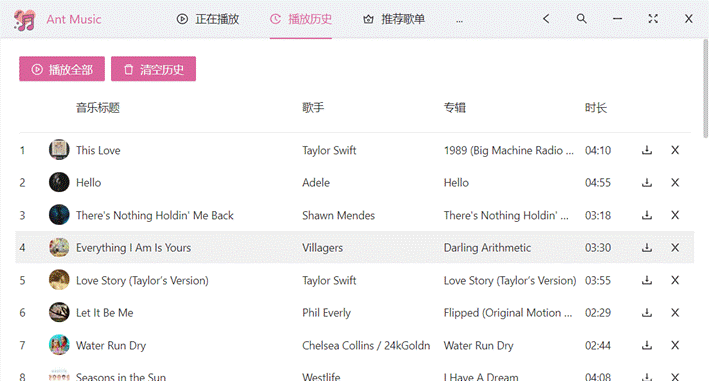
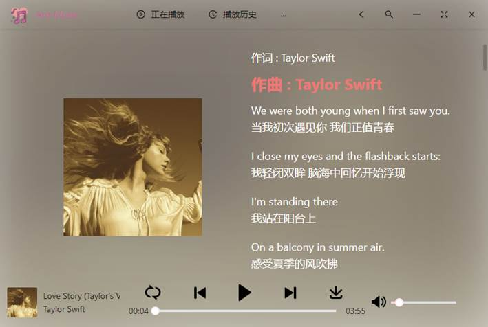
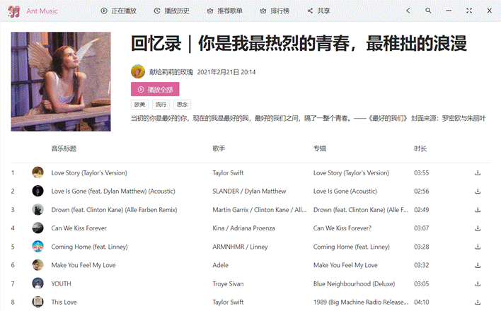
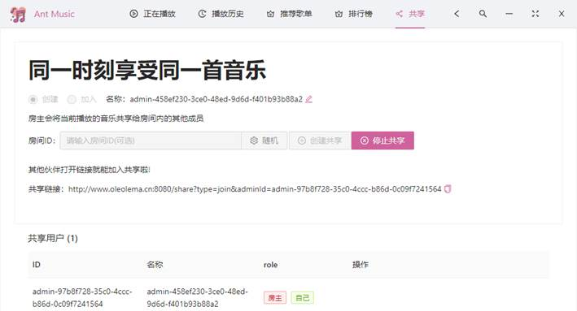
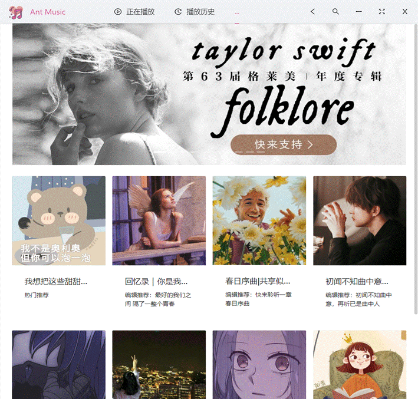

# Ant Music  多设备同步音乐播放器

毕设项目，后端使用Kotlin， 前端使用React

项目在线演示：[http://www.oleolema.cn:8080/](http://www.oleolema.cn:8080/)   

同步效果截屏：

一、排行榜

 

 

 

 

二、搜索

 

 

三、播放历史

 

四、全屏播放

 

 

 

五、歌单详情

 

 

六、共享

 

 

七、推荐歌单

 

 
